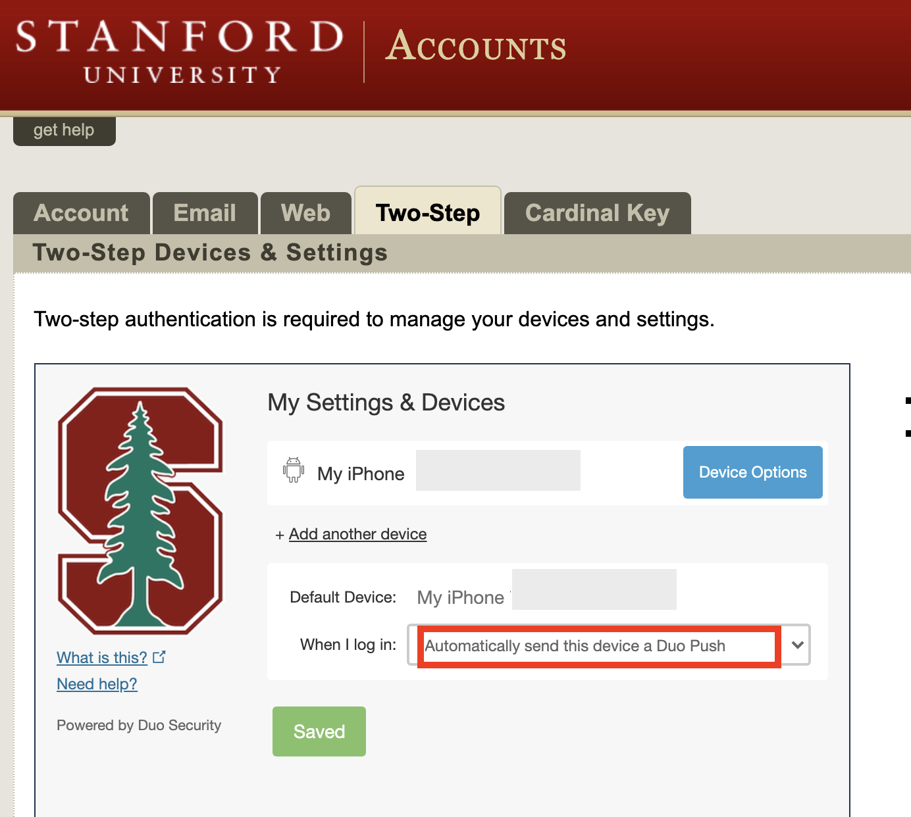

# Stanford Health Check

Goal: Automating the daily health checks with python.

## Dependencies

- Python 3
- Selenium
```
    pip install selenium
```
- Webdriver (ChromeDriver)
I used the lastest stable release: https://chromedriver.chromium.org/

**Make sure to set PATH variable in the HealthCheck_Github.py python script as the directory to your webdriver. I put it in my Applications folder**

- Set Stanford Two-factor Authentication to automatically use duo-mobile



## How to use

Clone the repository in terminal
```
git clone https://github.com/akirosingh/Stanford_Health_Check
cd Stanford_Health_Check
python3 HealthCheck_Github.py <SUNetID> <password> <building>
```
The python script has three arguments your sunetid, password, and the building you expect to attend today. It will open you Stanford Health check tool leading to a two-factor authentication action. **If you don't have this default to duo-mobile it will get stuck here and won't work**. The script gives you 30 seconds to two-factor authenticate then it will update the date you last were on campus, add the buildings you expect to enter and submit the health check. 

---

TODO: Add to google cloud to run on a schedule when my alarm clock goes off 

TODO: Update negative covid test date as an optional argument